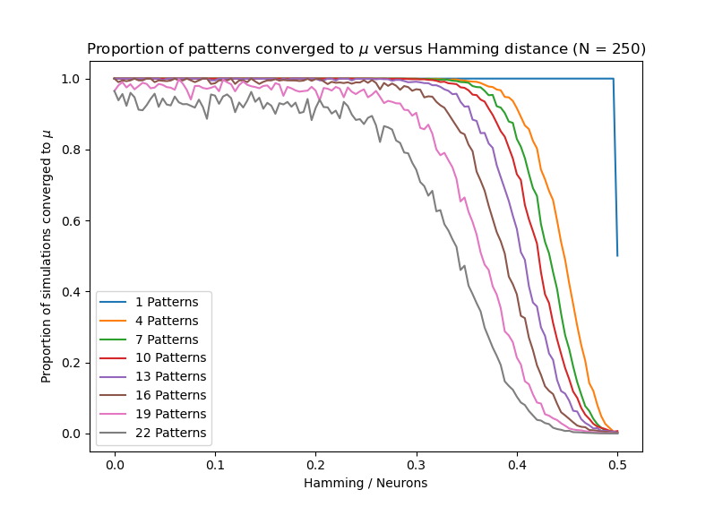
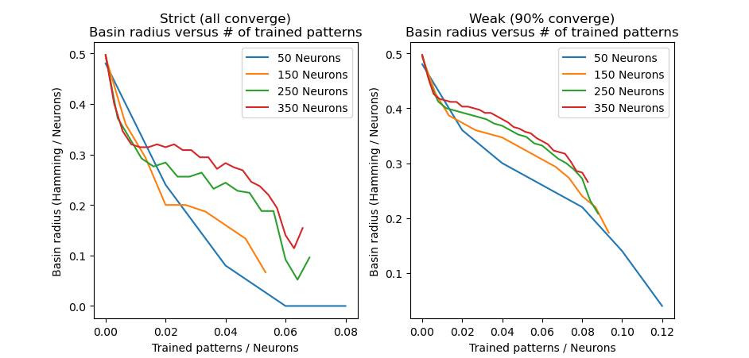
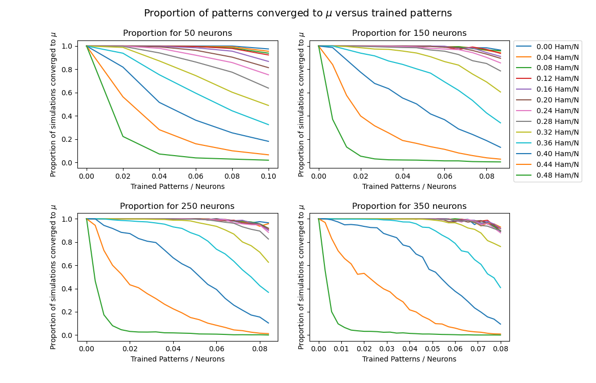

# Hopfield Network Basin Radius

This repo contains the simulations to analyze how Hopfield networks converge on attraction basins under the assumption of trained uniformly random patterns for various network sizes, patterns, and more.

Please see `src/hopfield.cpp` and `src/matrix.cpp` for the bulk of the implementation

Here are some graphs:

Note: this is just for test purposes/for a paper and not a library.
